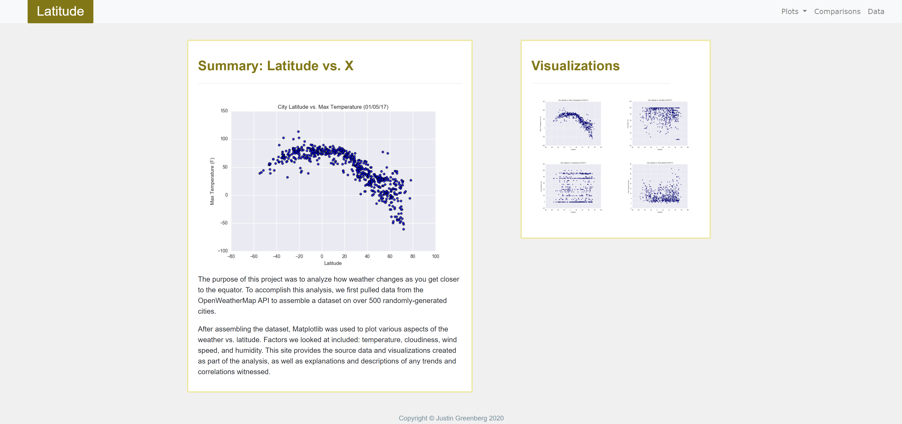

# Web-Design-Challenge
*HTML, CSS, Bootstrap on data from OpenWeatherAPI*

## Background
This activity focuses on sharing data with others, incorporating what has been learned about HTML and CSS to create a dashboard showing off analysis.


## Navigating this Repository
The folder **WebVisualiaztion** functions as a directory, containing the **html** files as well as **assets**, **resources**, and **visualizations**  folders.

<a href="https://drainganggtb.github.io/Web-Design-Challenge/WebVisualizations/index" target="_blank">This page is public through GitHub Pages.</a>

## Latitude Analysis Dashboard with Attitude
For this homework, a visualization dashboard website was created to show figures created in the <a href="https://github.com/drainganggtb/python-api-challenge" target="_blank">Python API assignment </a>. Specifically, these data have to do with weather readings for 500 randomly-generated cities.

In building this dashboard, individual pages for each plot were made so that navigation between them is possible. These pages contain the visualizations in a larger size along with explanations. Additionally, a landing page, comparison page between all indicators, and raw data page are accessable. 

### Website Requirements
The website must contain 7 pages total, including:
- A <a href="https://drainganggtb.github.io/Web-Design-Challenge/WebVisualizations/index" target="_blank">Landing page </a> containing:
    - An explanation of the project
    - Links to each visualization page. There should be a sidebar containing preview images of each plot, and clicking an image should take the user to that visualization. 
- Four visualization pages that:
    - Contain all of the visualizations on the same page so we can visually compare them. 
    - Uses a Bootstrap grid for the visualizations:
        - The grid must be two visualiaztions across the screens medium and larger, and 1 across on extra-small and small screens.
- A Data page that:
    - Displays a responsive table containing the data used in visualizations.
        - The table must be a Bootstrap table component. 
        - The data must come from exporting the .csv file as HTML, or converting it to HTML. One way this can be done is the ```to_html``` method in **Pandas**

#### The website must, at the top of every page, have a navigation menu that:
- Has the name of the site on the left of the nav which allows users to return to the landing page from any page. 
- Contains the dropdown menu on the right of the navbar named "Plots" that provides a link to each individual visualization page. 
- Provides two more text links on the right *Comparisons*, which links to the comparisons page, and *Data*, which links to the data page.
- Is responsive using media queries.

<h3>Finally, the website must be deployed to GitHub pages.<h3>
<a href="https://drainganggtb.github.io/Web-Design-Challenge/WebVisualizations/index" target="_blank">Here</a> is the link to GitHub Pages. 

